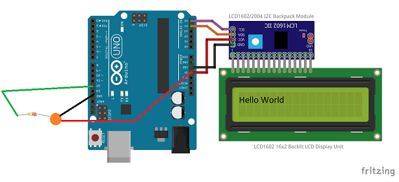

# Hard-Arduino
## LCD
### Description
The goal of this project was to get a LCD to display text and then use a button and LCD to count the number of times the button has been pressed. 
### Code
```C++
// LCD code Engineering 2

int buttonpin = 12; //set pin for button to 12
int buttonstate = 0;
int previousbuttonstate = 0;
int counter = 0; 
#include <Wire.h>
#include <LiquidCrystal_I2C.h> 
LiquidCrystal_I2C lcd(0x3F,16,2);  // set the LCD address to 0x27 for a 16 chars and 2 line display.  
// If 0x27 doesn't work, try 0x3F.

void setup() {
  pinMode(buttonpin, INPUT); //set button as input
  lcd.init();
  lcd.backlight();
}

void loop() {
  lcd.setCursor(0, 0); //set the lcd cursor to first column and first row 
  lcd.print("My Name is Zachary"); //lcd displays "My Name is Zachary" on first line
  buttonstate = digitalRead(buttonpin); //read state of button
  lcd.setCursor(0, 1); //set cursor to column 1, row 2
  lcd.print("Button number : "); //lcd displays the button number
  if (buttonstate == HIGH && previousbuttonstate == LOW) { //if you press the button
    counter +=1; //counter goes up by 1
    lcd.print(counter); //lcd displays the counter value
  } 
  buttonstate = previousbuttonstate; //set the button to off after it is released
  delay(100); //delay so it doesn't count more than one value per press
}
```
### Wiring Diagram


### Reflection
## Photointerupter
### Description
### Code
```
int Led = 8;
int photo = 2;
int val;
int photostate = 0;
volatile byte state = LOW;
int counter = 0; //variables

void setup() {
  pinMode(Led, OUTPUT); //set led as output
  pinMode(photo, INPUT_PULLUP);    //output/input pins
  Serial.begin(9600);           //links serial monitor
  attachInterrupt(digitalPinToInterrupt(photo), Read, CHANGE);   //interrupts photo pin, makes state unequal which turns LED on
}

void loop() {
  digitalWrite(Led, state);

  Serial.print(state);//Prints state and counter value
  Serial.print("   ");
  Serial.println(counter/2);
}

void Read() {
  state = !state; //Makes state unequal
  counter++;}
```
### Wiring Diagram
### Reflection
